# MMO Hacking Bootcamp

> This is a mirror of 
> [my thread on guidedhacking](https://guidedhacking.com/threads/15173/)

What you will end up with after following this guide:
[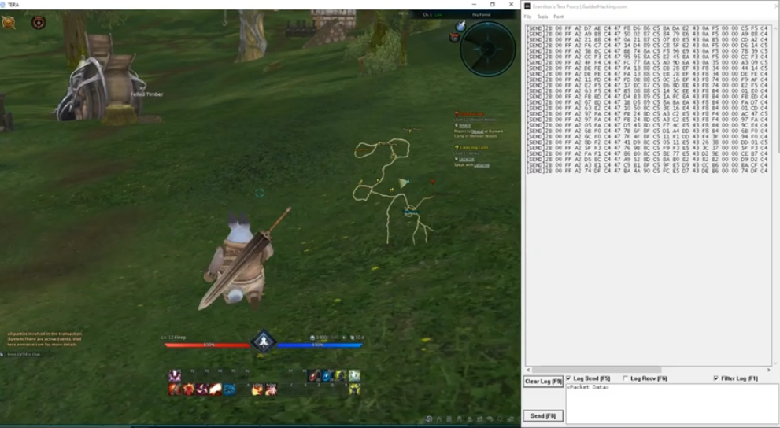](https://youtu.be/5ELH6Jq2vUI)

You can find the source code to all of this [here](./src/)


Hello and welcome to my first real guide or tutorial on this Forum.

Since i got inspired by this talk: https://youtu.be/QOfroRgBgo0 recently 
I decided to give that a try myself.

I hope you find this guide useful and also enjoy reading it.
Please feel free to give feedback on this guide and on the code as well.
So let's get started :)

## Introduction
In MMO hacking there are as always multiple approches.
Our goal however is not to write a bot for the game or anything like that.

We are trying to find exploits in the protocol of the game.
For that we want to do Man in the middle attacks so we can fuzz the games protocol by crafting our own packets.
To be able to do that we will create our own packet editor in the first part of this guide.
After that we try to understand the protocol and identify possible vulns.

For this guide i have taken the game Tera as an example but everything in this guide
does also apply to any other MMO.


If you don't understand everything quite yet:
Don't worry this is a step by step guide.
Meaning I will take you by the hand :)

## Recon
First of all you always want to do some recon on the game first before jumping right into hacking it.
That includes finding out which engine/language was used to create the game, which frameworks, which anticheat
gets used (if any) etc.
Also search for previous work done on the game that can save a lot of debugging and re work.
Im sure you all know how to do that.
However here are some little tricks you might find useful to fill this section with at least some information :)
- You can use Process Hacker to view the command line arguments which where used to start the game.
This can be helpful when you want to start the game without the launcher.
(ProcessHacker: https://processhacker.sourceforge.io/)
- You can use Process Monitor to see all traffic a process is sending and recieving.
That can give you insight and let you know whether the packets are encrypted at all.
Most of the time the packets will be encrypted.
(Process Monitor: https://docs.microsoft.com/en-us/sysinternals/downloads/procmon)

## Tool creation
As you have seen in our Recon phase we are lucky and dont have to deal with any anti cheat technology.
And that is  a common trend in MMOs.
However they prevent tinkering with the game by different means.
Sent and recieved packets are always encrypted and they do also encrypt data in memory pretty often to prevent the usual memory editing (with cheat engine for example).

So How do we get around that?:
We will hook the packet creation process in an early stage where we can read the raw unencrypted data of the packets.

For that we have to find the internal/high level send function the game uses to send packets itself and hook there.

As Mambda has saied his guide this can be a tadious process so i will cover this step in great detail to hopefully make it less tedious for you.

### Finding the Internal / High level Send function
Communication between server and client always happens either through TCP or UDP packets.
In theory there can be a list of functions used for sending and recieving these packets.
(Mambda has listed most of these in his packet guide)
But unless your game is very exotic or old, it will most likely use the ws2_32.dll for networking and make use of either the send() function or the WSASend() function for sending packets.
However if your game sends packets over udp instead of tcp it will most likely use the sendto() equivalents.
For recieving Data either recv() or WSARecv() are used.
I wont cover hooking/finding the recv() function in this guide.

After all that saied let's get started.
So our first problem is: finding out which function used by our game.
This is relatively easy to do in cheat engine or any other debugger.
We just set a breakpoint at the send() function and see if its get hit.

So let's go through this step by step.
1) attach cheat engine to our game:
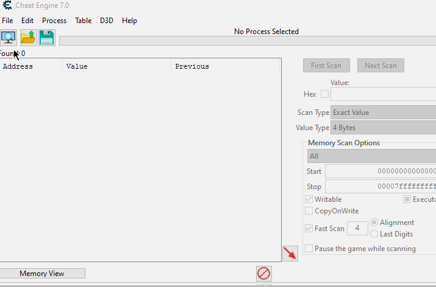
2) find the send function:
To locate the send function we have to open the Memory View in cheat engine.
In the View Menu we can enumerate all loaded dlls.
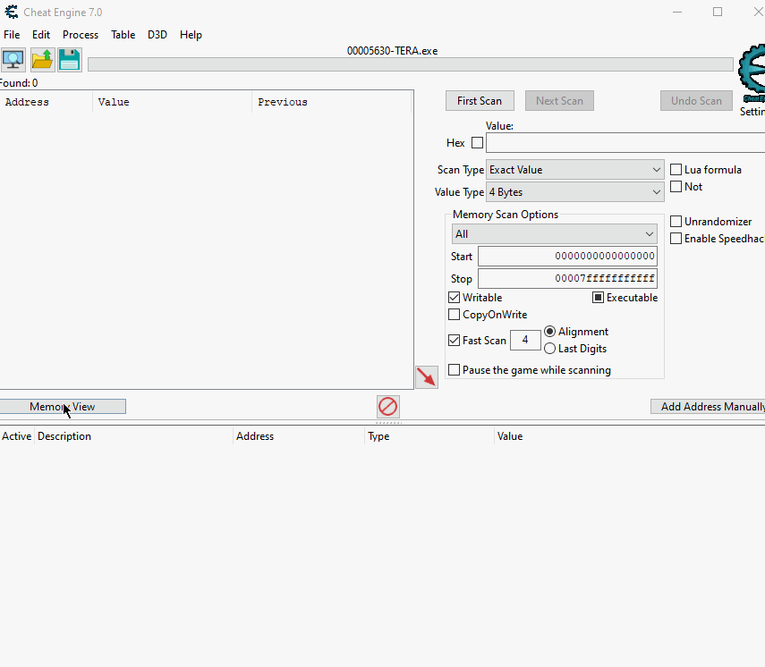
From here we can search for the ws2_32.dll and its send() function.
If we double click the function cheat engine will take us there.
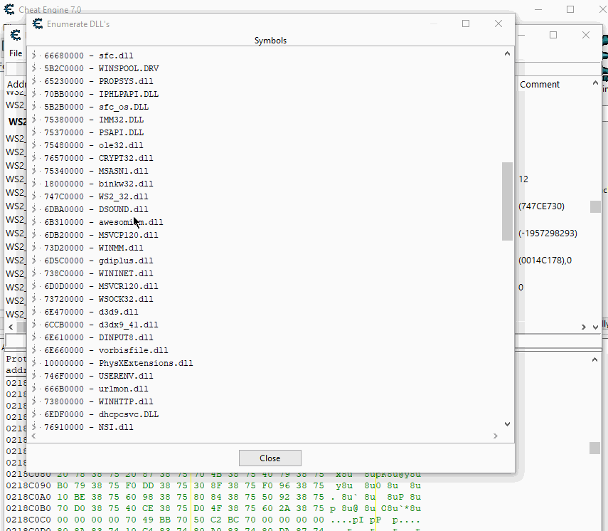
3) set a breakpoint at the send function:
To find out whether our function gets called by the game at all we need to set a breakpoint at the send() function. It should get triggered every time we do something in game.
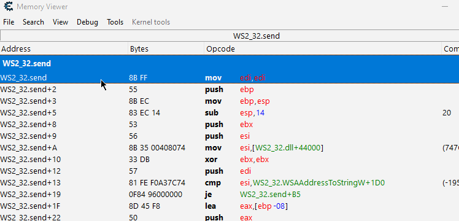
If your breakpoint gets hit and the games execution stops once we do something in game -> great.
If not -> you have to repeat the last step with a different send function and see if that one gets called.

4) finding the internal send:
This is one of the harder parts in this guide but i will try my best to guide you through even if your game is different.
At first it's important to understand the send function our game is using.
For that always search MSDN for the used send function.
In my case send():
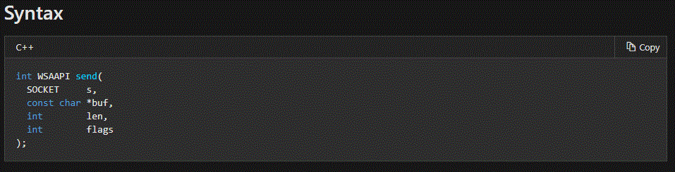
(https://docs.microsoft.com/en-us/windows/win32/api/winsock2/nf-winsock2-send)
as we can see the 2nd parameter is a char* to our (encrypted) buffer and the 3rd is the length of our buffer.
These are the most important for us.

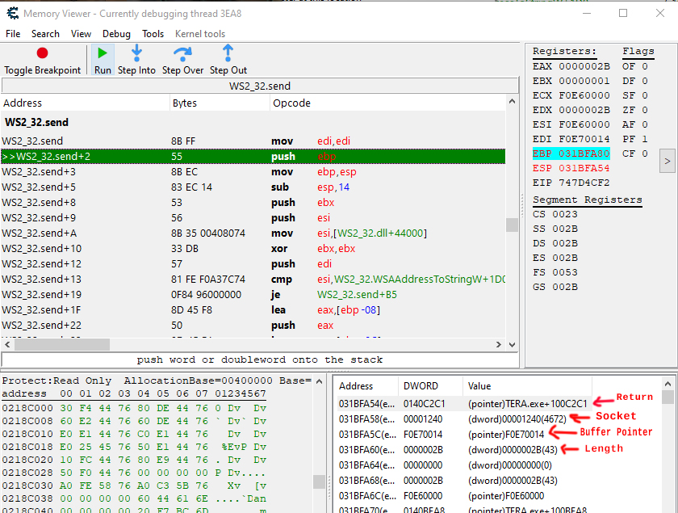

As you can see with our breakpoint hit we can inspect the current stack.
The first address on the stack (the one pushed onto the stack) will always be the return address (where the function got called from). After that we can see the srguments the function expects pushed onto the stack.
I have marked the ones that are important for us.
Now we have multiple options to go from here to find our internal send function.
One would be to double click the return address to get to where the send() function got called from and repeat that until we can find the send function the game uses itself (before the packets get encrypted).
The other way is to add the address of the encrypted buffer to cheat engines address table
and then -> find out what writes to this address.

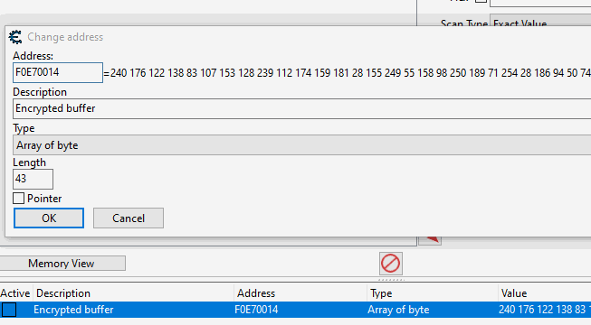

This will only work if the address of the encrypted buffer doesnt change too often.
But it has the charm that we can will find the end of the encryption function most of the time straigt away.
After that we just have to trace back again by placing a breakpoint at the encrypt function to see the return address on the stack there. If we double click there to see where it got called from and repeat that process maybe some layers upwards we can find our internal send function pretty quick.
Most of the time its the best to use a mixture of both methods depending on what your game is doing to reach your goal "quickly". What i did to find the send function for this game was to first tracke back where the send function got called from and followed the buffer. As i saw the buffer gets passed to the function that calles send as an argument i added that buffer to the address list and had a look for what writes to it.
It appears that tera uses a wrapper around the send() function thats just there to call send() really.
However this procedure is different for every game and it's important that you understand basic revrsing and debugging for you find your send function successfully.
There can be a lot of places that write to the buffer and you might have to do multiple hooks.
However if there is a unified send function in the game it has to write to the buffer at least once for every action you take. So you can ignore the opcodes that only write to the buffer for certain actions most times.
It's still a good idea to note down the addresses of these opcodes as well so you can still check them out later.

(I greatly enjoyed the workshop at https://begin.re it mostly covers static analysis. But im sure if you struggle to understand what the game is doing this workshop will help you to get to the next level :))

After you have spent some time reversing the game and tracing functions back you will most likely have found the internal send function (or given up).
Here is the one i found for Tera:

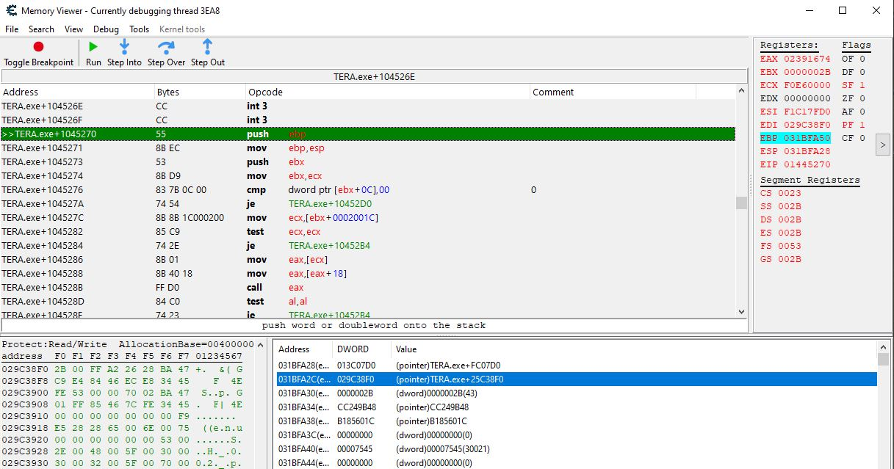

As we can see on the stack this function takes a pointer to the buffer and it's length as argument.
This will be helpful to know later.
### Hooking the send function
we now have some options we could modify the packet with the hook itself or just log it and call the send function ourself later.
Since i aimed at a packet editor like the one Mafred uses i decided to go with the 2nd option.
So we just need to acess the packet buffer and it's length through our hook so we can log the packet.
i wont cover how to do hooking since this was covered here: https://guidedhacking.com/threads/code-detouring-hooking-guide.14185/
but i will explain what i do in my hook.
First lets have a quick look:
```
    void* teax;
    void* tebx;
    void* tecx;
    void* tedx;
    void* tesi;
    void* tedi;
    void* tebp;
    void* tesp;

    DWORD sentLen;
    char* sentBuffer;

    void __declspec(naked) sendHookFunc() {
    __asm {
        mov teax, eax; backup
        mov tebx, ebx
        mov tecx, ecx
        mov tedx, edx
        mov tesi, esi
        mov tedi, edi
        mov tebp, ebp
        mov tesp, esp
        mov eax, [esp + 0x8]
        mov sentBuffer, eax
        mov eax, [esp + 0xC]
        mov sentLen, eax
    }
    printSendBufferToLog();
    __asm{
        mov eax, teax
        mov ebx, tebx
        mov ecx, tecx
        mov edx, tedx
        mov esi, tesi
        mov edi, tedi
        mov ebp, tebp
        mov esp, tesp; end of restore
        mov ebp, esp
        push ebx
        mov ebx, ecx
        jmp[jmpBackAddrSend]
    }
}

```

first we have some backup variables to back up the registers.
You could just push them to the stack and pop them back later.
But i decided to just store the values of the registers in variables.
It's important to do that if we are panning to call c++ function from within our hook since they will most likely change the registers and we don't want them to have changed at the end of our hook since that can influence the following code gets executed. That's why we restore them just before we execute the opcodes that we overwrote with our hook.
esp is the stack pointer through that pointer we can access values that go pushed to the stack.
That means esp -> first element on the stack, esp +0x4 -> 2nd element, esp + 0x08 -> 3rd ...

### Calling the send function
To call any function we need to follow the calling convetion the function likes to be called by.
(More on calling convetions: https://docs.microsoft.com/en-us/cpp/cpp/argument-passing-and-naming-conventions?view=vs-2019)
However we can make it easy for ourselfs and dont worry too much about this since most games use the `__thiscall`
calling convetion for the send function since this convetion is used for any function that is part of a class.
(So this calling convetion is used for every method!).
To call a function like this we first need to get the pointer to the class it belongs to.

As we can see we can get the this pointer from the ECX register.
The easiest way to get ourself a copy of that pointer is just to add this to our hook:
```
void* thisPTR;

//this goes inside our asm block:
mov thisPTR, ecx

```

Since we already figured out the arguments the function takes we can now define the type of the function.
And since we already know the location of the function we can initialize a variable of that type with that location:
```
typedef void (__thiscall* InternalSend)(void* thisClass, const char* data, DWORD length);
InternalSend Send = (InternalSend)0x1445270;
```
(more on function pointers: https://www.learncpp.com/cpp-tutorial/78-function-pointers/)

After that we can use this Send function like any other function in our code and sould be able to send packets to the server ourselves.

with the finished packet editor this looks like this:


### writing the Packet Editor DLL
Now we finally have enough information to write the packet editor.
We for now only have the static address of the send function but MMOs tend to patch regularely.
That means this way we might have to find the send sunction every patch.
To avoid that problem i decided to use pattern scanning to find the send function.
For that i have used Rakes tutorial and code.
(Pattern Scan Tutorial: https://guidedhacking.com/threads/external-internal-pattern-scanning-guide.14112/)

#### Scan.h
```
#pragma once
//Tanks to rake for this code here and Nomade for making it more stable
char* ScanBasic(const char* pattern, const char* mask, char* begin, size_t size){
    size_t patternLen = strlen(mask);
    for (size_t i = 0; i < size; i++){
        bool found = true;
        for (size_t j = 0; j < patternLen; j++){
            if (mask[j] != '?' && pattern[j] != *(char*)((intptr_t)begin + i + j)){
                found = false;
                break;
            }
        }
        if (found){
            return (begin + i);
        }
    }
    return nullptr;
}

char* ScanInternal(const char* pattern, const char* mask, char* begin, size_t size){
    char* match{ nullptr };
    MEMORY_BASIC_INFORMATION mbi{};

    for (char* curr = begin; curr < begin + size; curr += mbi.RegionSize){
        if (!VirtualQuery(curr, &mbi, sizeof(mbi)) || mbi.State != MEM_COMMIT || mbi.Protect == PAGE_NOACCESS) continue;
        match = ScanBasic(pattern, mask, curr, mbi.RegionSize);

        if (match != nullptr && match != pattern){
            break;
        }
    }
    return match;
}

```

For the hooking i wrote a simple class that cleans up after itself so we can load and unload the dll without crashing the game.

#### Hook.h
```
#pragma once
class Hook {
    void* tToHook;
    char* oldOpcodes;
    int tLen;
public:
    Hook(void* toHook, void* ourFunct, int len) : tToHook(toHook), oldOpcodes(nullptr), tLen(len){
        if (len < 5) {
            return;
        }

        DWORD curProtection;
        VirtualProtect(toHook, len, PAGE_EXECUTE_READWRITE, &curProtection);

        oldOpcodes = (char*)malloc(len);
        if (oldOpcodes != nullptr) {
            for (int i = 0; i < len; ++i) {
                oldOpcodes[i] = ((char*)toHook)[i];
            }
        }

        memset(toHook, 0x90, len);

        DWORD relativeAddress = ((DWORD)ourFunct - (DWORD)toHook) - 5;

        *(BYTE*)toHook = 0xE9;
        *(DWORD*)((DWORD)toHook + 1) = relativeAddress;

        VirtualProtect(toHook, len, curProtection, &curProtection);
    }

    ~Hook() {
        if (oldOpcodes != nullptr) {
            DWORD curProtection;
            VirtualProtect(tToHook, tLen, PAGE_EXECUTE_READWRITE, &curProtection);
            for (int i = 0; i < tLen; ++i) {
                ((char*)tToHook)[i] = oldOpcodes[i];
            }
            VirtualProtect(tToHook, tLen, curProtection, &curProtection);
            free(oldOpcodes);
        }
    }
};
```

Everything game specific i have handeled in another header file.
It especially takes care of holding pointers to the send function and holds the code we execute in our hook:

#### Tera.h
```
#pragma once
typedef void (__thiscall* InternalSend)(void* thisClass, const char* data, DWORD length);
InternalSend Send;
void* thisPTR;
wchar_t moduleName[] = L"TERA.exe";
size_t toHookSend = 1;
int sendHookLen = 5;
DWORD sentLen;
char* sentBuffer;
char* tmpBuffer;

const char* internalSendPattern = "\x55\x8B\xEC\x53\x8B\xD9\x83\x7B\x0C\x00\x74\x54\x8B\x8B\x1C\x00\x02\x00\x85\xC9\x74\x2E\x8B\x01\x8B\x01\x8B\x40\x18\xFF\xD0";
const char* internalSendMask = "xxxxxxxxxx??xx????xxxxxxx";

bool logSentHook = false;

void* teax;
void* tebx;
void* tecx;
void* tedx;
void* tesi;
void* tedi;
void* tebp;
void* tesp;

void printSendBufferToLog();

DWORD jmpBackAddrSend;
void __declspec(naked) sendHookFunc() {
    __asm {
        mov thisPTR, ecx
        mov teax, eax; backup
        mov tebx, ebx
        mov tecx, ecx
        mov tedx, edx
        mov tesi, esi
        mov tedi, edi
        mov tebp, ebp
        mov tesp, esp
        mov eax, [esp + 0x8]
        mov sentBuffer, eax
        mov eax, [esp + 0xC]
        mov sentLen, eax
    }
    if (logSentHook) {
        printSendBufferToLog();
    }
    __asm{
        mov eax, teax
        mov ebx, tebx
        mov ecx, tecx
        mov edx, tedx
        mov esi, tesi
        mov edi, tedi
        mov ebp, tebp
        mov esp, tesp; end of restore
        mov ebp, esp
        push ebx
        mov ebx, ecx
        jmp[jmpBackAddrSend]
    }
}

```

And lastly we have have the main dll. This file holds the entry point to our dll, spins up the GUI of our packet editor (using the WinApi) and so on. This file holds the main logic for our editor.

#### dllmain.cpp
```
#include "pch.h"
#include <windows.h>
#include <iostream>
#include <iomanip>
#include "Tera.h"
#include "Hook.h"
#include "Scan.h"
#include <vector>

#define MYMENU_EXIT (WM_APP + 100)
#define SEND_BUTTON (WM_APP + 101)
#define LOG_SEND (WM_APP + 102)
#define CLEAR_BUTTON (WM_APP + 104)

HMODULE inj_hModule;
HWND hCraftedPacket;
HWND hLog;

BOOL LogSend = 0;
BOOL LogRecv = 0;

HWND hLogSend;
HWND hLogRecv;

wchar_t craftedBuffer[533];
char bufferToSend[533];
char const hex_chars[16] = {'0','1','2','3','4','5','6','7','8','9','A','B','C','D','E','F'};

uintptr_t moduleBase;
std::vector<char> logText;

HMENU CreateDLLWindowMenu(){
    HMENU hMenu;
    hMenu = CreateMenu();
    HMENU hMenuPopup;
    if (hMenu == NULL)
        return FALSE;
    hMenuPopup = CreatePopupMenu();
    AppendMenuW(hMenuPopup, MF_STRING, MYMENU_EXIT, TEXT("Exit"));
    AppendMenuW(hMenu, MF_POPUP, (UINT_PTR)hMenuPopup, TEXT("File"));
    return hMenu;
}

LRESULT CALLBACK MessageHandler(HWND hWindow, UINT uMessage, WPARAM wParam, LPARAM lParam) {
    switch (uMessage) {
    case WM_CLOSE:
    case WM_DESTROY:
        PostQuitMessage(0);
        return 0;
        break;
    case WM_COMMAND:
        switch (LOWORD(wParam)) {
        case MYMENU_EXIT:
            PostQuitMessage(0);
            return 0;
            break;
        case SEND_BUTTON:
            GetWindowText(hCraftedPacket, craftedBuffer, 533);
            size_t len;
            wcstombs_s(&len, bufferToSend, 533, craftedBuffer, 533);
            size_t i;
            i = 0;
            for (size_t count = 0; count < len; ++i, count += 3) {
                if (bufferToSend[count] >= 'A') {
                    bufferToSend[count] -= 'A';
                    bufferToSend[count] += 10;
                }
                else {
                    bufferToSend[count] -= 48;
                }

                if (bufferToSend[count+1] >= 'A') {
                    bufferToSend[count+1] -= 'A';
                    bufferToSend[count+1] += 10;
                }
                else {
                    bufferToSend[count+1] -= 48;
                }

                bufferToSend[i] = (__int8)(((char)bufferToSend[count]) * (char)16);
                bufferToSend[i] += (__int8)bufferToSend[count + 1];
            }
            bufferToSend[i] = '\0';
            if (thisPTR != 0) {
                Send(thisPTR, bufferToSend, i);
            }
            break;
        case LOG_SEND:
            LogSend = IsDlgButtonChecked(hWindow, LOG_SEND);
            
            if (LogSend == BST_CHECKED) {
                CheckDlgButton(hWindow, LOG_SEND, BST_UNCHECKED);
                logSentHook = false;
            }
            else {
                CheckDlgButton(hWindow, LOG_SEND, BST_CHECKED);
                logSentHook = true;
            }
            break;
        case CLEAR_BUTTON:
            logText.erase(logText.begin(), logText.end());
            SetWindowTextA(hLog, "Cleared! :)\r\nFind Tutorials on Guidedhacking.com!");
        }
    }
    return DefWindowProc(hWindow, uMessage, wParam, lParam);
}

//Register our windows Class
BOOL RegisterDLLWindowClass(const wchar_t szClassName[]) {
    WNDCLASSEX wc;
    wc.hInstance = inj_hModule;
    wc.lpszClassName = (LPCWSTR)szClassName;
    wc.lpfnWndProc = MessageHandler;
    wc.style = CS_VREDRAW | CS_HREDRAW;
    wc.cbSize = sizeof(WNDCLASSEX);
    wc.hIcon = LoadIcon(NULL, IDI_SHIELD);
    wc.hIconSm = LoadIcon(NULL, IDI_SHIELD);
    wc.hCursor = LoadCursor(NULL, IDC_ARROW);
    wc.lpszMenuName = NULL;
    wc.cbClsExtra = 0;
    wc.cbWndExtra = 0;
    wc.hbrBackground = GetSysColorBrush(COLOR_BTNFACE);
    if (!RegisterClassEx(&wc))
        return 0;
    return 1;
}

inline void printSendBufferToLog() {
    char sendID[] = "[SEND] ";

    while (logText.size() > 4096) {
        logText.erase(logText.begin(), logText.begin() + 400);
    }
    if (logText.size() > 1) {
        logText.pop_back();
        logText.push_back('\r');
        logText.push_back('\n');
    }
    
    for (DWORD i = 0; i < sentLen + 7; ++i) {
        if (i < 7) {
            logText.push_back(sendID[i]);
        }
        else {
            logText.push_back(hex_chars[((sentBuffer)[i - 7] & 0xF0) >> 4]);
            logText.push_back(hex_chars[((sentBuffer)[i - 7] & 0x0F) >> 0]);
            logText.push_back(' ');
        }
    }
    logText.push_back('\0');
    SetWindowTextA(hLog, &logText[0]);
}

DWORD WINAPI WindowThread(HMODULE hModule){
    logText = std::vector<char>();
    moduleBase = (uintptr_t)GetModuleHandle(moduleName);
    Send = (InternalSend)(ScanInternal(internalSendPattern, internalSendMask, (char*)(moduleBase+ 0x0500000), 0x3000000));
    toHookSend += (size_t)Send;
    jmpBackAddrSend = toHookSend + sendHookLen;

    Hook* sendHook = new Hook((void*)toHookSend, (void*)sendHookFunc, sendHookLen);
   
    MSG messages;
    HMENU hMenu = CreateDLLWindowMenu();
    HWND hSendButton;
    HWND hClearButton;
    
    RegisterDLLWindowClass(L"InjectedDLLWindowClass");
    HWND hwnd = CreateWindowEx(0, L"InjectedDLLWindowClass", L"Erarnitox's Tera Proxy | GuidedHacking.com", WS_EX_LAYERED, CW_USEDEFAULT, CW_USEDEFAULT, 1020, 885, NULL, hMenu, inj_hModule, NULL);
    hLog = CreateWindowEx(0, L"edit", L"Tera Proxy made by Erarnitox\r\n!!! visit GuidedHacking.com !!!", WS_CHILD | WS_VISIBLE | WS_VSCROLL | ES_MULTILINE | ES_AUTOVSCROLL | WS_BORDER | ES_READONLY, 5, 5, 1005, 700, hwnd, NULL, hModule, NULL);

    hClearButton = CreateWindowEx(0, L"button", L"Clear Log", WS_TABSTOP | WS_CHILD | WS_VISIBLE | WS_BORDER | BS_DEFPUSHBUTTON, 5, 710, 100, 30, hwnd, (HMENU)CLEAR_BUTTON, hModule, NULL);
    hSendButton = CreateWindowEx(0, L"button", L"Send", WS_TABSTOP | WS_CHILD | WS_VISIBLE | WS_BORDER | BS_DEFPUSHBUTTON, 5, 800, 100, 30, hwnd, (HMENU)SEND_BUTTON, hModule, NULL);
    hCraftedPacket = CreateWindowEx(0, L"edit", L"<Packet Data>", WS_TABSTOP | WS_VISIBLE | WS_CHILD | ES_MULTILINE | WS_BORDER, 110, 730, 900, 100, hwnd, NULL, hModule, NULL);

    hLogSend = CreateWindowEx(0, L"button", L"Log Send", WS_CHILD | WS_VISIBLE | BS_CHECKBOX, 110, 705, 100, 25, hwnd, (HMENU)LOG_SEND, hModule, NULL);

    ShowWindow(hwnd, SW_SHOWNORMAL);
   
    while (GetMessage(&messages, NULL, 0, 0)){
        if (GetAsyncKeyState(VK_END) & 1) {
            break;
        }
        TranslateMessage(&messages);
        DispatchMessage(&messages);
    }

    //exit:
    delete sendHook;
    FreeLibraryAndExitThread(hModule, 0);
    return 0;
}

BOOL APIENTRY DllMain(HMODULE hModule, DWORD  ul_reason_for_call, LPVOID lpReserved){
    switch (ul_reason_for_call){
        case DLL_PROCESS_ATTACH:
            inj_hModule = hModule; 
            HANDLE ThreadHandle = CreateThread(0, NULL, (LPTHREAD_START_ROUTINE)WindowThread, hModule, NULL, NULL);
            
            if (ThreadHandle != NULL) {
                CloseHandle(ThreadHandle);
            }
        break;
    }
    return TRUE;
}

```
I didnt write comments even tho i planed to do so.
I know it's still a lot of code to throw in at once in a tutorial but i tried to keep it as simple as possible.
I have taken the comments out to not confuse you even more. That might leave some of you with questions to what some part of the code does. So if you have anything you dont understand feel free to ask about it below and i will try my best to explain it and update the thread to make it easier to understand for future readers.

## understanding the Protocol
now that we have the capability to view and log unencrypted packets we need to understand the protocol of the game.
I actually was lucky and found the repo of somebody who already did a lot of reversing on the games protocol.
Repo: https://github.com/tera-proxy/tera-data/tree/master/protocol
This isnt the exact protocol i have found to be used in the game but this was definetly a head start.

But what if you are not that lucky or are even the first one to reverse that game?
Well it is tedious work but we will go though how one would tackle this:
First we want to record some packets we can analyze for a specific action.
Since we are mostly interested in economy exploits to make us rich we will take a look at the packets that have to do with transactions first.
For that purpose we will deposit gold to our bank and note down the packet that was sent as well as the amount of money we deposited.
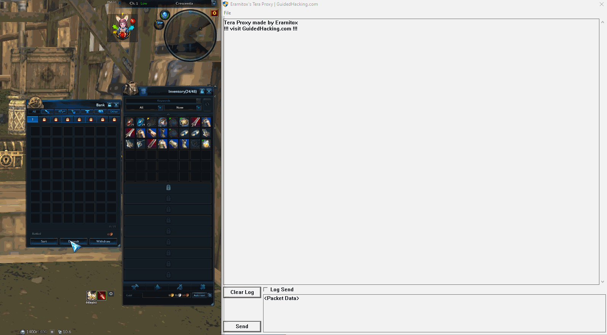
After some transactions we end up with a list like this:

```
5g 0s 0b:    40 00 A4 D8 01 00 00 00 F8 4B CF 00 79 1D 09 10 00 80 00 03 01 00 00 00 00 00 00 00 50 C3 00 00 00 00 00 00 FF FF FF FF FF FF FF FF FF FF FF FF 00 00 00 00 00 00 00 00 00 00 00 00 FF FF FF FF
2g 7s 3b:    40 00 A4 D8 02 00 00 00 65 4F CF 00 79 1D 09 10 00 80 00 03 01 00 00 00 00 00 00 00 DF 50 00 00 00 00 00 00 FF FF FF FF FF FF FF FF FF FF FF FF 00 00 00 00 00 00 00 00 00 00 00 00 FF FF FF FF
1g 8s 70b:   40 00 A4 D8 03 00 00 00 24 4F CF 00 79 1D 09 10 00 80 00 03 01 00 00 00 00 00 00 00 76 2A 00 00 00 00 00 00 FF FF FF FF FF FF FF FF FF FF FF FF 00 00 00 00 00 00 00 00 00 00 00 00 FF FF FF FF
1g 3s 1b:    40 00 A4 D8 04 00 00 00 C3 4F CF 00 79 1D 09 10 00 80 00 03 01 00 00 00 00 00 00 00 3D 28 00 00 00 00 00 00 FF FF FF FF FF FF FF FF FF FF FF FF 00 00 00 00 00 00 00 00 00 00 00 00 FF FF FF FF
0g 50s 10b:  40 00 A4 D8 05 00 00 00 28 51 CF 00 79 1D 09 10 00 80 00 03 01 00 00 00 00 00 00 00 92 13 00 00 00 00 00 00 FF FF FF FF FF FF FF FF FF FF FF FF 00 00 00 00 00 00 00 00 00 00 00 00 FF FF FF FF
```
if you copy this list in a proper text editor you can straight away tell some obvious patterns:

- the fith byte seems to be a sequence number that goes up by 1 for each transaction we do to or from the bank.
- only the 3 bytes after the 9th byte and the 2 bytes after the 28th byte change
so at least one of them is related to our transaction amount.

After a high level inspection we will copy a packet in a hex editor to see different representations for the data at these 2 interesting spots of the packet.
I use HxD for this.
(Get HxD here: https://mh-nexus.de/en/downloads.php?product=HxD20)
(2g 7s 3b packet:)
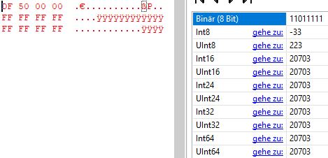
We have found out that the 28th byte does infact contain our gold amount.
To find out what exact datatype it is we need to find out what the other bytes in the transaction packet do.
After some more time reversing the packet structure i found out the packet structure looks something like this:
```
struct transactionPacket{
char[4] id;
__int16 sequence;
__int16 page;
...
int64 gold;
...
};
```
to confirm we found the right spot and didnt miss any checksums or anything we craft our own transaction packet with a modified amount and send it to the server:
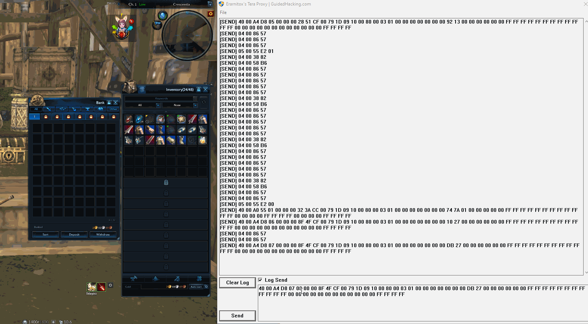

## Fuzzing
Now that we can intercept the games traffic we should think about what to target.
Since integer overflows appear to be a common problem this is what we will tackle first.
After thinking about where they could appear some things come to mind:
- Deposit negative money
- Widthdraw negative money
- ...

This can cause interesting things to happen because databases usually store unsigned integeres where the games often work with signed integers. This is not the only problem but it seems to be a common one. So if they missed a sanity check and a negative number gets stored in the database it overflows and thus gets interpreted as a really high value.

Another common thing appears to be race conditions.

Think about how you would have programed something and where there might be problems.
It's also important to think out of the box well to find things that went unnoticed by others.
Every game is different and works differently so the flaws are different too.

Other ideas to check for:
- anywhere an id gets transmitted -> what happens if you change thange the id for another one?
- check for logout/ save packets -> If inventory doesnt get saved you can give everythig away and load the previously saved inventory from the database.
- what happens when you move items to invalid slots?
- sell the same item multiple times at once -> sanity check if it exists in inventory = true
- delete negative items
- any fees could be used to overflow an intger if sanity checks happen before fees where applied

The idea with swaping the id is that games sometimes have a false trust in packets sent from the client since they encrypt everything and it also reduces the load on the server.
So this does not only go for ids but everything that might get trusted by the gameserver.

In this guide i didnt cover hooking the recv function of the game since it is pretty much the same as finding and hooking the send function. Also in most games the recieved packets ar not as interesting as the sent ones and you have to keep in mind that the recv function gets called constantly. That means doing alot in your hook will slow or even crahs the game. That beeing saied it can stll be interesting to see how the gameserver reacts when you send its own packets back. This could be something to try when the opcodes (first bytes) of the server and client packets are the same. Meaning they share the same protocol or language.

For this most important part of the process it's really necessary to be patient and get into the right mindset:
"trying to break it".
It can take weeks or even longer to find flaws and be able to exploit them.
But according to some talks i have heared there is pretty much always at least one exploit in any mmo that can be found using this or similar techniques.

You can also extend the packet editor with specific tools for your game so it's easier for you to find exploits.

I didn't find anything interesting in Tera yet. But i this is also my first day of actively searching so im still optimistic.

This wraps it up for this guide but here are some links you might find useful if you are interested in that topic:
- Manfred Defcon Talk: https://youtu.be/QOfroRgBgo0
- Manfred Workflow: https://youtu.be/iYTCBPUn98c
- Manfred RSA Talk: https://www.rsaconference.com/industry-topics/presentation/anatomy-of-exploiting-mmorpgs
- Bot creation: https://www.youtube.com/watch?v=WMlkC5L4UZk&list=PLJ3SX0ZSwtLVnZFgCwgpgPTJKF9ugpDUP
- Bot creation: https://youtu.be/T-rn6squ_E4
- analyzing Packets: https://progamercity.net/ghack-tut/137-tutorial-packet-hacking-reversing-mmo.html
- Pwnie island writeup: https://www.youtube.com/watch?v=RDZnlcnmPUA&list=PLhixgUqwRTjzzBeFSHXrw9DnQtssdAwgG
- More on reversing protocols: https://youtu.be/9pCb0vIp_kg
- Mambdas Guide on packets: https://guidedhacking.com/threads/the-basics-of-packets-case-study-maplestory.14074/
- How to locate send function: https://www.elitepvpers.com/forum/metin2-guides-templates/4151499-how-locate-packetsend-function-nearly-every-game.html

- Thank you for reading and i hope you learned something from this thread.
- Special thanks goes out to MAMBDA he is a very skilled and helpful member and also helped to make this article.
- Make sure to check out his work on MS it's really great:
- https://guidedhacking.com/threads/maplestory-packet-hack-ngs-bypass.14202/

- Also if you want to be able to view the packet log in game have a look this thread:
https://guidedhacking.com/threads/gatekeeper-packet-inspector-reclass-based.13933/
